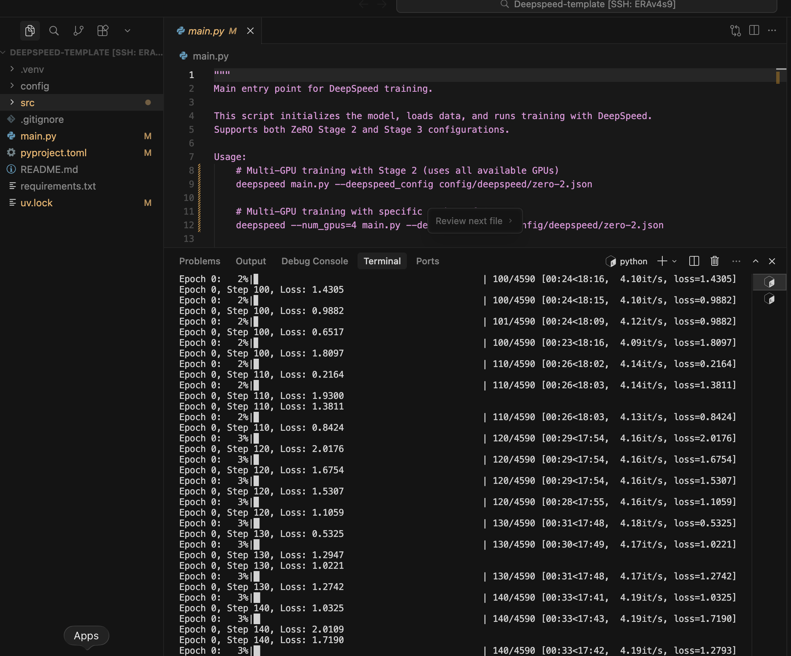
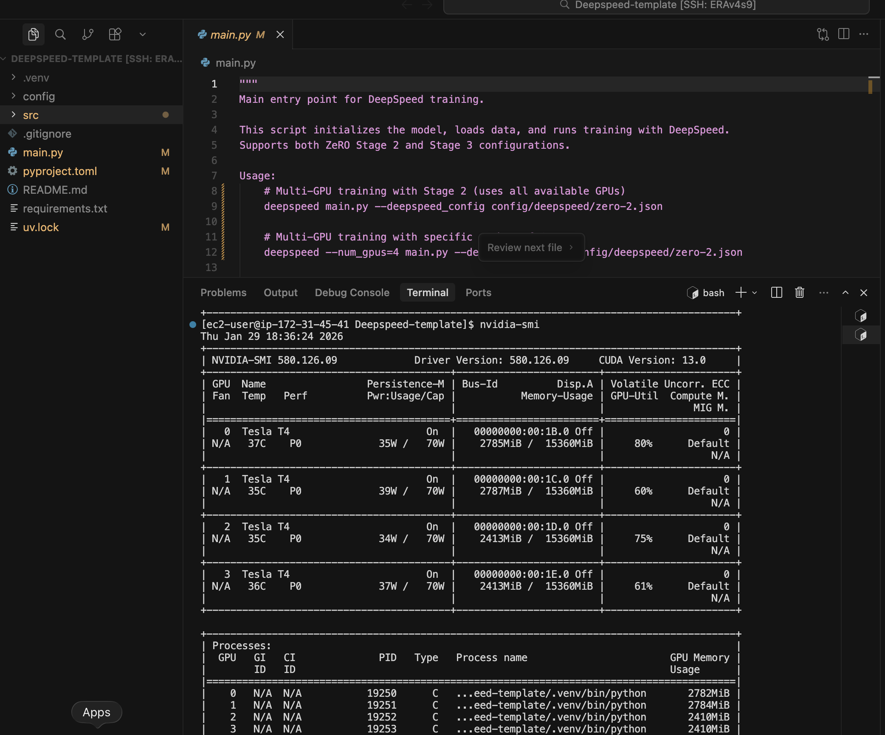

# DeepSpeed Training Template

A modular and well-structured template for training language models using DeepSpeed with ZeRO optimization stages 2 and 3.

## 📁 Project Structure

```
Deepspeed-Template/
├── config/
│   └── deepspeed/
│       ├── zero-2.json          # ZeRO Stage 2 configuration
│       └── zero-3.json          # ZeRO Stage 3 configuration
├── src/
│   ├── __init__.py              # Package initialization
│   ├── data.py                  # Data loading and tokenization utilities
│   ├── train.py                 # Training, evaluation, and generation functions
│   └── utils.py                 # General utilities (seed setting, etc.)
├── assets/
│   └── images/                  # Training verification screenshots
├── main.py                      # Main entry point
├── requirements.txt             # Python dependencies
├── pyproject.toml              # Project configuration
└── README.md
```

## ✅ Verified Training Results

This template has been tested and verified on AWS g4dn.12xlarge instances (4x Tesla T4 GPUs, 16GB each). Below are proofs of successful training:

### Training in Progress

*DeepSpeed training running with ZeRO Stage 2, showing epoch progress and loss convergence*

### GPU Utilization

*nvidia-smi output showing all 4 GPUs being utilized effectively with distributed memory allocation*

### Hardware Configuration

**Tested on**: AWS g4dn.12xlarge instance
- **GPUs**: 4x NVIDIA Tesla T4 (16GB each)
- **Total GPU Memory**: 64GB
- **vCPUs**: 48
- **RAM**: 192GB

## 🚀 Features

- **Modular Design**: Separate modules for training and configuration
- **ZeRO Stage 2**: Optimizer state partitioning with CPU offload
- **ZeRO Stage 3**: Full model parallelism (optimizer + parameters + gradients)
- **Mixed Precision Training**: FP16 for faster training and reduced memory
- **Flexible Configuration**: Easy to switch between different DeepSpeed configurations
- **Progress Tracking**: Built-in progress bars and logging
- **Text Generation**: Test your model with custom prompts
- **Checkpoint Support**: Save and load model checkpoints
- **Multi-GPU Support**: Tested on 4x Tesla T4 GPUs (AWS g4dn.12xlarge)
- **Reproducibility**: Configurable random seed for reproducible experiments
- **Data Loading**: Pre-built tokenization and data loading utilities

## 📋 Requirements

### System Requirements

**CUDA Toolkit** is required for DeepSpeed to run. Make sure you have:
- NVIDIA GPU(s) with CUDA support
- CUDA Toolkit 11.8+ or 12.x installed
- Compatible NVIDIA drivers

To verify CUDA is available:
```bash
nvidia-smi
nvcc --version
```

### Python Dependencies

This project uses [uv](https://github.com/astral-sh/uv) for fast and reliable Python package management.

#### Install uv (if not already installed)

```bash
pip install uv
```

#### Install dependencies

```bash
uv sync
```

Or install individually:

```bash
uv pip install torch>=2.0.0 torchvision>=0.15.0
uv pip install deepspeed>=0.12.0
uv pip install transformers>=4.35.0 datasets>=2.14.0
uv pip install tqdm>=4.65.0
```

> **Note**: The project includes `pyproject.toml` and `uv.lock` for dependency management. DeepSpeed requires CUDA toolkit to be installed on your system for GPU acceleration.

## 🎯 Quick Start

### Multi-GPU Training (ZeRO Stage 2)

Uses all available GPUs:

```bash
deepspeed main.py --deepspeed_config config/deepspeed/zero-2.json
```

Or specify number of GPUs:

```bash
deepspeed --num_gpus=4 main.py --deepspeed_config config/deepspeed/zero-2.json
```

### Advanced Training (ZeRO Stage 3)

```bash
deepspeed main.py --deepspeed_config config/deepspeed/zero-3.json
```

### Single GPU Training (for testing)

```bash
python main.py --deepspeed_config config/deepspeed/zero-2.json
```

### Custom Configuration

```bash
deepspeed --num_gpus=4 main.py \
    --deepspeed_config config/deepspeed/zero-2.json \
    --model_name distilgpt2 \
    --num_epochs 3 \
    --batch_size 16 \
    --max_length 256 \
    --seed 42 \
    --save_checkpoint \
    --output_dir ./my_checkpoints
```

## ⚙️ Configuration Options

### Command Line Arguments

| Argument | Default | Description |
|----------|---------|-------------|
| `--model_name` | `distilgpt2` | HuggingFace model name |
| `--dataset_name` | `wikitext` | Dataset name |
| `--dataset_config` | `wikitext-2-raw-v1` | Dataset configuration |
| `--batch_size` | `8` | Training batch size |
| `--max_length` | `128` | Maximum sequence length |
| `--num_epochs` | `1` | Number of training epochs |
| `--seed` | `42` | Random seed for reproducibility |
| `--deepspeed_config` | `config/deepspeed/zero-2.json` | DeepSpeed config path |
| `--save_checkpoint` | `False` | Save checkpoint after training |
| `--output_dir` | `./checkpoints` | Checkpoint output directory |
| `--generation_prompt` | `The history of...` | Prompt for text generation |

### DeepSpeed Configurations

#### ZeRO Stage 2 (`config/deepspeed/zero-2.json`)

**What it does:**
- Partitions optimizer states across GPUs
- Offloads optimizer states to CPU memory
- Reduces memory footprint while maintaining speed

**Best for:**
- Medium-sized models (up to a few billion parameters)
- Multi-GPU setups with limited GPU memory
- Balancing speed and memory efficiency

**Key Features:**
- Optimizer state partitioning
- CPU offloading for optimizer states
- Gradient clipping
- Mixed precision (FP16)
- Learning rate warmup

#### ZeRO Stage 3 (`config/deepspeed/zero-3.json`)

**What it does:**
- Partitions optimizer states, gradients, AND model parameters
- Offloads both optimizer states and parameters to CPU
- Maximum memory savings for largest models

**Best for:**
- Very large models (billions to trillions of parameters)
- Limited GPU memory scenarios
- Training models that don't fit in GPU memory otherwise

**Key Features:**
- Full model parallelism
- Optimizer + parameter + gradient partitioning
- CPU offloading for optimizer and parameters
- Prefetching and communication overlap
- Model state gathering for checkpointing

## 🔧 Module Details

### `src/data.py`

Data loading and tokenization utilities:
- `get_tokenizer()`: Loads and configures tokenizer from HuggingFace
- `get_dataloaders()`: Creates train/eval/test dataloaders with tokenization
- `tokenize_function()`: Tokenizes text examples for language modeling
- Supports HuggingFace datasets with automatic filtering and batching

### `src/train.py`

Training and inference logic:
- `train_epoch()`: Trains model for one epoch with progress tracking
- `evaluate()`: Evaluates model and computes loss and perplexity
- `generate_text()`: Generates text from prompts with configurable sampling
- `save_checkpoint()`: Saves model checkpoints using DeepSpeed
- `load_checkpoint()`: Loads model checkpoints

### `src/utils.py`

General utility functions:
- `set_seed()`: Sets random seeds across all libraries (Python, NumPy, PyTorch) for reproducibility
- Ensures deterministic behavior for consistent experimental results

### `main.py`

Main orchestration script that handles:
- Command-line argument parsing
- Random seed initialization for reproducibility
- Data loading with HuggingFace datasets
- Tokenizer initialization
- Model loading from HuggingFace Hub
- DeepSpeed engine initialization
- Training loop execution
- Validation and test set evaluation
- Text generation testing
- Checkpoint management

## 📊 Understanding ZeRO Stages

### Memory Distribution

```
ZeRO Stage 0 (Baseline):
GPU 0: [Model] [Optimizer] [Gradients]
GPU 1: [Model] [Optimizer] [Gradients]

ZeRO Stage 2:
GPU 0: [Model] [Optimizer Part 1] [Gradients Part 1]
GPU 1: [Model] [Optimizer Part 2] [Gradients Part 2]
       + CPU: [Optimizer States]

ZeRO Stage 3:
GPU 0: [Model Part 1] [Optimizer Part 1] [Gradients Part 1]
GPU 1: [Model Part 2] [Optimizer Part 2] [Gradients Part 2]
       + CPU: [Optimizer States] [Model Parameters]
```

### When to Use Each Stage

| Stage | Memory Savings | Speed | Use Case |
|-------|---------------|-------|----------|
| Stage 1 | 4x | Fastest | Small-medium models, plenty of GPU memory |
| Stage 2 | 8x | Fast | Medium models, limited GPU memory |
| Stage 3 | 15x+ | Moderate | Large models, very limited GPU memory |

## 🎓 Example Workflows

### 1. Quick Test Run (Single GPU)

```bash
# Train for 1 epoch with limited steps
python main.py \
    --deepspeed_config config/deepspeed/zero-2.json \
    --max_train_steps 50 \
    --max_eval_steps 20
```

### 2. Full Training with Checkpointing (Multi-GPU)

```bash
# Train and save checkpoint on 4 GPUs
deepspeed --num_gpus=4 main.py \
    --deepspeed_config config/deepspeed/zero-3.json \
    --num_epochs 5 \
    --batch_size 16 \
    --save_checkpoint \
    --output_dir ./checkpoints/run1
```

### 3. Custom Model Training (Multi-GPU)

```bash
# Train a different model on all available GPUs
deepspeed main.py \
    --model_name gpt2 \
    --deepspeed_config config/deepspeed/zero-3.json \
    --batch_size 4 \
    --max_length 512 \
    --num_epochs 3
```

## 🐛 Troubleshooting

### Out of Memory Errors

1. Try Stage 3 instead of Stage 2
2. Reduce `batch_size`
3. Reduce `max_length`
4. Enable gradient checkpointing (add to config)

### Slow Training

1. Try Stage 2 instead of Stage 3
2. Increase `batch_size` if memory allows
3. Disable CPU offloading if you have enough GPU memory
4. Adjust `gradient_accumulation_steps`

### Import Errors

```bash
# Make sure all dependencies are installed
uv sync

# Or install individually
uv pip install deepspeed transformers datasets torch tqdm
```

## 📝 Customization

### Using Your Own Dataset

The template includes data loading utilities in `src/data.py`. To use your own dataset, modify the `get_dataloaders()` function:

```python
# src/data.py
def get_dataloaders(dataset_name, dataset_config, tokenizer, batch_size, max_length):
    """Create train/eval/test dataloaders."""
    
    # Option 1: Load from HuggingFace (already implemented)
    dataset = load_dataset(dataset_name, dataset_config)
    
    # Option 2: Load from local files
    from datasets import Dataset
    import pandas as pd
    
    df = pd.read_csv("your_data.csv")
    dataset = Dataset.from_pandas(df)
    
    # Option 3: Load from custom source
    # Your custom data loading logic here
    
    # Then tokenize and create dataloaders
    tokenized = dataset.map(lambda x: tokenize_function(x, tokenizer, max_length))
    # ... rest of the function
```

### Ensuring Reproducibility

To ensure reproducible experiments across runs, always set the seed:

```bash
# All runs with the same seed will produce identical results
deepspeed main.py --seed 42 --deepspeed_config config/deepspeed/zero-2.json

# Different seeds for different experimental runs
deepspeed main.py --seed 123 --deepspeed_config config/deepspeed/zero-2.json
```

### Adding Custom Metrics

Edit `src/train.py` and modify the `evaluate()` function:

```python
def evaluate(model_engine, data_loader, phase="Evaluation", max_steps=None):
    # ... existing code ...
    
    # Add your custom metrics
    accuracy = compute_accuracy(predictions, labels)
    print(f"Accuracy: {accuracy:.4f}")
```

## 📚 Resources

- [DeepSpeed Documentation](https://www.deepspeed.ai/)
- [ZeRO Paper](https://arxiv.org/abs/1910.02054)
- [HuggingFace Transformers](https://huggingface.co/docs/transformers)
- [PyTorch Documentation](https://pytorch.org/docs/)

## 🤝 Contributing

Feel free to customize this template for your specific needs. Key areas to extend:

- Customize data loading in `src/data.py` for your specific datasets
- Add custom training strategies in `src/train.py`
- Create new DeepSpeed configurations in `config/deepspeed/`
- Add evaluation metrics and monitoring
- Implement additional model architectures
- Extend utilities in `src/utils.py`

## 📄 License

This template is provided as-is for educational and research purposes.

---

**Happy Training! 🚀**
